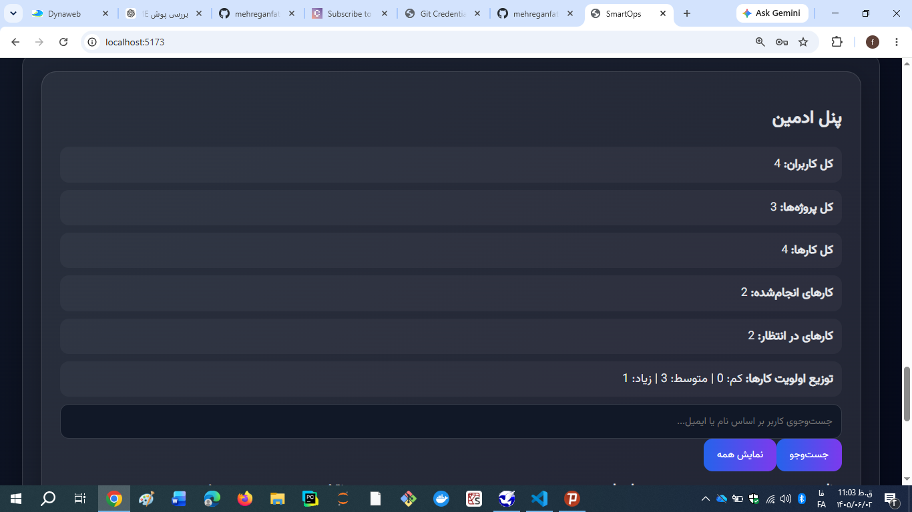
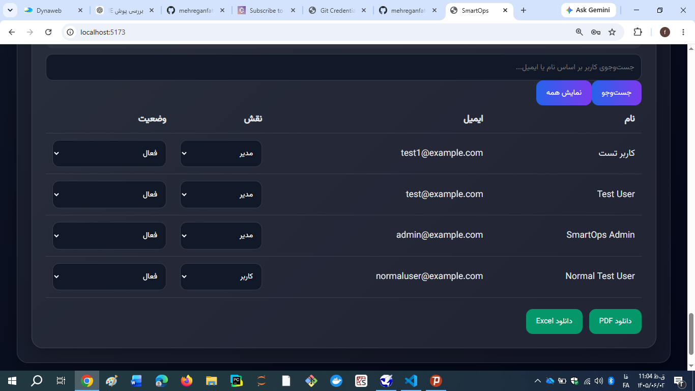
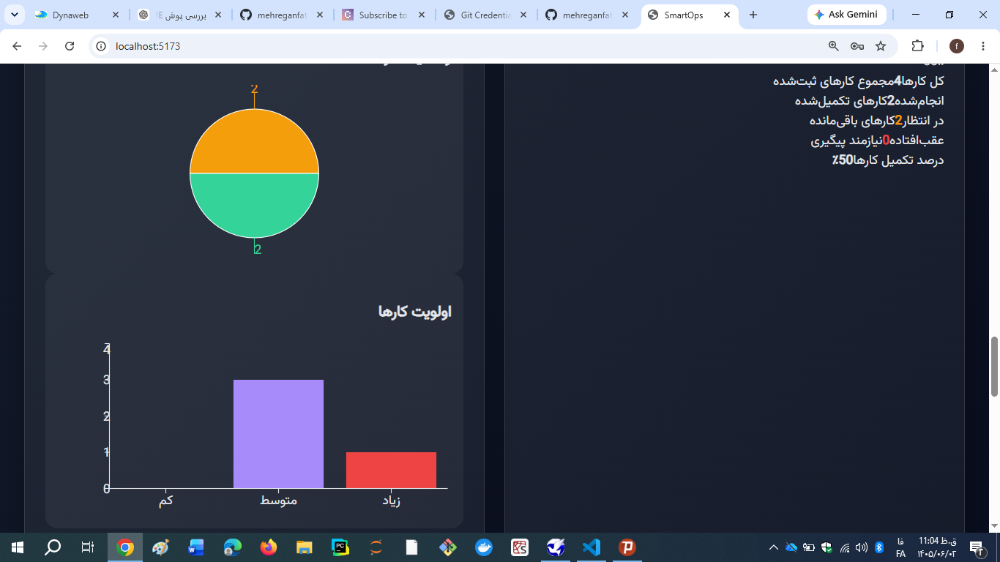
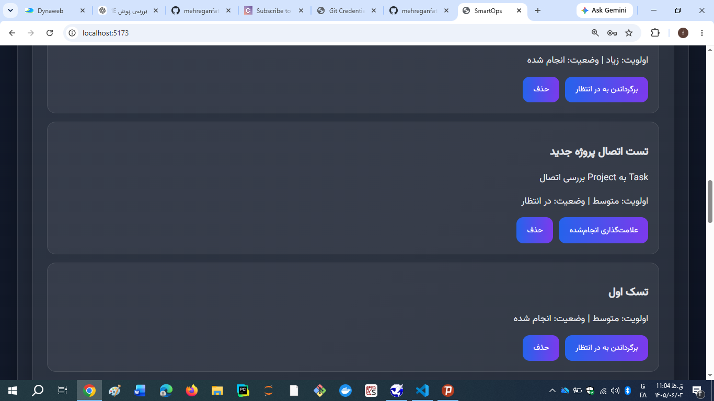

# SmartOps

SmartOps is a full-stack operations and task management platform designed to help teams manage projects, organize tasks, monitor operational activities, and generate professional reports.

## Overview

SmartOps provides a modern web-based environment for managing tasks and projects with authentication, role-based access control, dashboard statistics, administration tools, and report generation.

The project is built with a React frontend and a Node.js/Express backend connected to MongoDB Atlas.

## Features

- User registration and login
- JWT-based authentication
- Role-based access control
- User and administrator roles
- Task management
- Project management
- Task status and priority management
- Dashboard statistics
- Administration panel
- User status management
- RESTful API
- PDF report generation
- Excel report generation
- Persian and RTL text support in PDF reports
- MongoDB Atlas integration
- Automated backend testing
- Responsive React interface

## Technology Stack

### Frontend

- React
- Vite
- React Router
- Axios
- Recharts
- Lucide React

### Backend

- Node.js
- Express.js
- MongoDB
- Mongoose
- JSON Web Token (JWT)

### Reporting

- PDFKit
- ExcelJS
- Vazirmatn Font
- Persian/Arabic text shaping
- RTL report support

### Development Tools

- Git
- GitHub
- Jest
- Supertest
- PowerShell

## Application Architecture

```text
SmartOps
|
+-- Frontend
|   +-- React
|   +-- Vite
|   +-- React Router
|   +-- Axios
|   +-- Dashboard
|   +-- Admin Panel
|
+-- Backend
|   +-- Express.js
|   +-- Authentication
|   +-- Authorization
|   +-- Task API
|   +-- Project API
|   +-- Admin API
|   +-- Export API
|
+-- Database
    +-- MongoDB Atlas


Project Structure
SmartOps/
|
+-- backend/
|   +-- config/
|   +-- middleware/
|   +-- models/
|   +-- routes/
|   +-- tests/
|   +-- fonts/
|   +-- server.js
|
+-- frontend/
|   +-- src/
|       +-- api/
|       +-- components/
|       +-- context/
|       +-- pages/
|
+-- README.md
+-- package.json
Authentication and Authorization

SmartOps uses JWT-based authentication to protect private API endpoints.

The system supports role-based authorization with two main roles:

user
admin

Administrative operations are protected by authentication and administrator authorization middleware.

User passwords are securely hashed and are never stored as plain text.

Dashboard

The SmartOps dashboard provides an overview of operational activities, including task statistics and project information.

The dashboard is designed to give users a quick view of the current state of their work.

Task Management

SmartOps provides a complete task management workflow.

Users can:

Create tasks
View tasks
Update tasks
Delete tasks
Set task priority
Track task status
Associate tasks with projects
Project Management

Projects can be created and managed through the application.

Tasks can be organized around projects to provide better operational visibility and organization.

Administration Panel

The administration panel provides management capabilities for administrators.

Administrative features include:

User management
User status management
System statistics
Administrative task management
Report generation
Report Generation

SmartOps supports professional report generation in two formats.

PDF Reports

The system generates PDF reports using PDFKit.

The PDF export includes support for:

Persian text
Right-to-left text
Vazirmatn font
Task information
Project information
Report metadata

Special Persian and Arabic text processing is used to improve RTL rendering in generated documents.

Excel Reports

Excel reports are generated using ExcelJS and can be used for:

Data analysis
Administrative reporting
Task tracking
Operational records
API

The backend provides RESTful API endpoints for:

Authentication
Tasks
Projects
Administration
Reports
Health Check
GET /health

Example response:

{
  "status": "ok",
  "service": "SmartOps",
  "db": "MongoDB"
}
Installation
1. Clone the Repository
git clone https://github.com/mehreganfatemeh903-arch/SmartOps.git
cd SmartOps
2. Install Backend Dependencies
cd backend
npm install
3. Configure Environment Variables

Create a .env file inside the backend directory:

PORT=5000
MONGO_URI=your_mongodb_connection_string
JWT_SECRET=your_secure_jwt_secret
NODE_ENV=development

Do not commit .env files or other sensitive credentials to GitHub.

4. Start the Backend
npm start

The backend will normally be available at:

http://localhost:5000
5. Install Frontend Dependencies

Open another terminal:

cd frontend
npm install
6. Start the Frontend
npm run dev

The frontend will normally be available at:

http://localhost:5173
Testing

The backend includes automated tests using Jest and Supertest.

Run the test suite with:

cd backend
npm test

The test suite covers important API functionality including authentication, tasks, projects, administration, and related backend behavior.

Environment and Security

SmartOps follows common application security practices:

JWT authentication
Role-based authorization
Password hashing
Protected administrative routes
Environment variables for secrets
MongoDB connection configuration through environment variables

Sensitive configuration files should never be committed to the public repository.

Portfolio Highlights

SmartOps demonstrates practical full-stack development skills in:

React application development
Node.js and Express.js
REST API development
MongoDB and Mongoose
JWT authentication
Role-based access control
Dashboard development
Task and project management
PDF report generation
Excel report generation
Persian and RTL document processing
Automated API testing
Git and GitHub workflow
Project Status

SmartOps is an active portfolio project.

The architecture is designed to support future improvements such as:

Advanced analytics
Notifications
Activity history
Cloud deployment
Additional reporting tools
More advanced project management features
Author

Fatemeh Mehregan

Computer Engineering — Information Technology

Interested in:

Artificial Intelligence
Machine Learning
Full-Stack Development
Intelligent Business Applications
Software Engineering
Repository

GitHub:

https://github.com/mehreganfatemeh903-arch/SmartOps

License

This project is intended for portfolio and educational purposes.

## Screenshots

### Dashboard


### Task Management



### Project Management



### Administration Panel



### PDF Reporting



